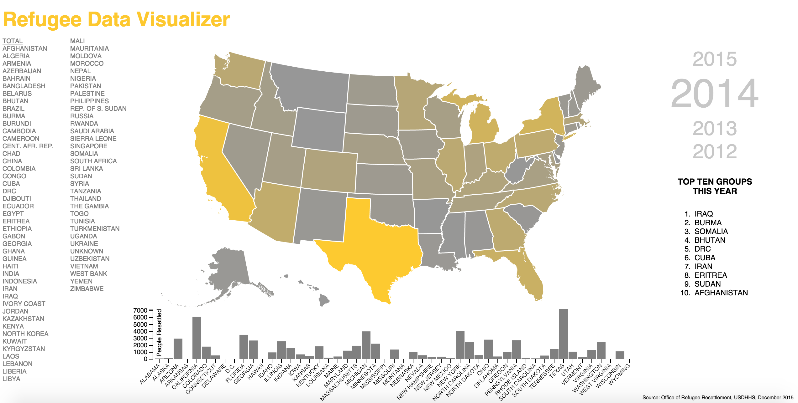

# Refugee Data Visualizer
Creator: Cyrus Shahrivar<br/>
Version 1.2 (July 2016)<br/>
https://refugee-data-viz.herokuapp.com/

#### Table of Contents
1. [Introduction](#intro)
2. [Technologies Used](#tech)
3. [Installation/Use Instructions](#use)
  - [Installation](#install)
  - [API Use](#api)
4. [Wireframes, User Stories, Planning, Project Proposal](#planning)
5. [Approach Taken](#approach)
6. [Unsolved Problems](#problems)
7. [Thoughts on Improvements to the Application](#improvements)
8. [Version History](#versions)

<a id="intro"></a>
#### Introduction
This is a data visualization application that enables the public to explore refugee resettlement patterns for various groups arriving in the US for the recent past. The intent was to enable more informed dialogue in a time of heated, opinionated debate about refugees and immigration.

<a id="tech"></a>
#### Technologies Used
- D3.js: data visualization library
- Node and Express: server and API
- HTML/CSS/SVGs: front end development

<a id="use"></a>
#### Installation/Use Instructions
<a id="install"></a>
##### Installation
If you desire to fork or clone this repo, please install NodeJS and Express globally on your machine prior to continuing.If you are not forking or cloning, to do a similar project you will also need to link to the D3.js and topojson libraries included in your HTML file.  I recommend also including Underscore.js to simplify your function declarations.

Finally, to deploy I used Heroku's NodeJS deployment instructions and hosted on Heroku.

<a id="api"></a>
##### API Use
To access JSON formatted data for each year included in application, simply go to the home route plus `/api/year/:year` like below:
```
<!-- Example  -->
https://refugee-data-viz.herokuapp.com/api/year/2012
```

<a id="planning"></a>
#### User Stories / Wireframes / Pitch Deck
- Wireframes:
https://github.com/cyrus-shahrivar/refugeeDataViz/blob/master/planning/wireframe1.JPG
https://github.com/cyrus-shahrivar/refugeeDataViz/blob/master/planning/wireframe2.JPG

- User Stories on Trello
https://trello.com/b/FAcCnDkZ/refugee-data-visualization

- Planning
https://github.com/cyrus-shahrivar/refugeeDataViz/blob/master/planning/planning.md

- Project Proposal
https://github.com/cyrus-shahrivar/refugeeDataViz/blob/master/planning/final-project-proposal.md

<a id="approach"></a>
#### Approach Taken
Initially, I wanted to have this app be both a visualization of refugee resettlement in the US for the recent past and a news scraper that would analyze community sentiment towards refugees, but I quickly decided to just do the visualization only as recent political discourse makes it difficult to find a positive sentiment towards refugee resettlement.  I realized that the visualization tool alone would be of great use in identifying resettlement trends.

I then grabbed data from the Office of Refugee Resettlement (a USDHHS office) and began to look at how the data was structured.  They don't have an external facing API, however, I was able to download datasets in spreadsheet format, export to CSV, then structure the files manually as JSON objects.  Once I had that information, I set out to find appropriate visualization examples from D3 that would be helpful for my website.  I started with code from the D3 website for the map feature and the bar-chart feature, and then I customized the code to fit the visuals I was hoping to display.

In implementing the visualization features, I quickly understood that I needed to do some data sanitization as many numbers were still in quotes if they were greater than 999 due to spreadsheet formatting adding thousand comma separators.  I had to redo the process of getting the data from the spreadsheets by first highlighting all the cells and setting the formatting to use no comma separators, and that fixed the problem.  I was able to re-export to CSVs and redo the JSON files and the data then came in fine.

As I was designing the site, I ran the site by potential users to gauge what features would be helpful. That provided useful feedback for the final design of the site.

NOTE: Puerto Rico and other US territories not included in this data visualization as my map visual was only of the US 50 states.  Puerto Rico and other territories received very few refugees in this analysis period.

<a id="problems"></a>
#### Unsolved Problems
- Rendering occurring before data loaded on initial page load
- Graph flickering

<a id="improvements"></a>
#### Thoughts on Improvements to the Application
- Add a help menu
- Have a landing page or modal to introduce people to the application and guide use and to help when needed
- Provide a mobile friendly implementation (may not be map based)
- Add url stored state to program to allow for easy social sharing
- Add social sharing API
- Provide way to toggle different types of visualizations (bar, line, map, tree, bubbles, other)
- Adding more data after 2015 FY (Oct. 1st to Sept. 30th), and from before 2012
  - Expect 2016 FY preliminary data available in Oct./Nov. 2016, verified set in Apr. 2017

<a id="versions"></a>
#### Version History
- Version 1.2: July 2016
  - Added complete set of 2015 data; minor style changes
- Version 1.1: July 2016
  - API created to provide access to JSON data publicly; README documentation updated; minor style changes
- Version 1: December 2015
  - Initial Release
